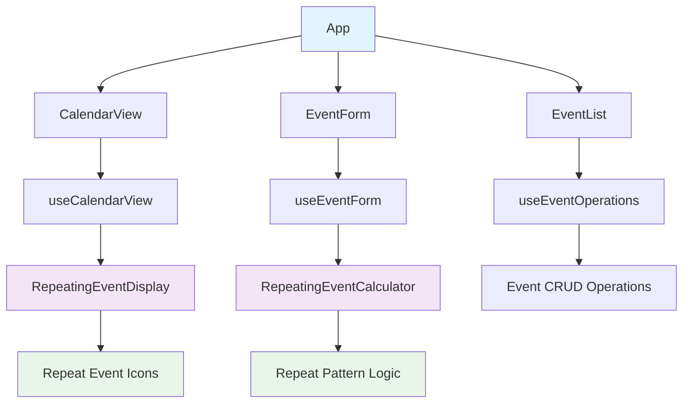

# Assignment-7 Brownfield Enhancement Architecture

**프로젝트:** Assignment-7 (캘린더 기반 이벤트 관리 시스템)  
**문서 버전:** v2.0  
**생성일:** 2024년  
**아키텍트:** Winston 🏗️  

---

## 1. 소개

이 문서는 Assignment-7 프로젝트의 기존 시스템 아키텍처를 분석하고 **프론트엔드 전용** 반복 일정 기능 향상을 위한 아키텍처적 접근 방식을 정의합니다. 이 프로젝트는 TypeScript/React 기반의 프론트엔드 전용 캘린더 애플리케이션으로, 이벤트 관리, 알림, 검색 등의 기능을 제공합니다.

**중요한 아키텍처 결정**: 백엔드 마이그레이션(데이터베이스, 인증 시스템 등)은 **모두 배제**하고, **프론트엔드에서만** 반복 일정 기능을 구현합니다.

**기존 아키텍처와의 관계:**
이 문서는 기존 프로젝트 아키텍처를 보완하여 새로운 컴포넌트가 현재 시스템과 어떻게 통합될지 정의합니다. 새로운 패턴과 기존 패턴 간의 충돌이 발생할 경우, 이 문서는 일관성을 유지하면서 향상을 구현하는 방법에 대한 가이드를 제공합니다.

### 1.1 기존 프로젝트 분석

#### 현재 프로젝트 상태

- **주요 목적:** 캘린더 기반 이벤트 관리 시스템
- **현재 기술 스택:** React 19.1.0, TypeScript 5.2.2, Vite 7.0.2, Material-UI 7.2.0
- **아키텍처 스타일:** 컴포넌트 기반, 커스텀 훅 중심의 상태 관리
- **배포 방식:** Vite 개발 서버 + Express 백엔드 (로컬 개발용)
- **데이터 관리:** 로컬 JSON 파일 기반 (실제 프로덕션 환경 없음)

#### 사용 가능한 문서

- `package.json` - 의존성 및 스크립트 정의
- `tsconfig.json` - TypeScript 설정
- `vite.config.ts` - 빌드 및 개발 서버 설정
- `server.js` - 로컬 개발용 Express 서버
- `src/types.ts` - 타입 정의
- `src/hooks/` - 커스텀 훅 모음
- `src/utils/` - 유틸리티 함수들

#### 식별된 제약사항

- **백엔드 인프라 부재:** 실제 데이터베이스나 클라우드 서비스 없음
- **데이터 지속성:** 로컬 JSON 파일에만 의존
- **확장성 제한:** 단일 사용자 환경만 고려
- **보안 부재:** 인증/인가 시스템 없음
- **성능 최적화 부족:** 대용량 데이터 처리 고려 없음

---

## 2. 향상 범위 및 통합 전략

### 2.1 향상 개요

**향상 유형:** 기존 프론트엔드 시스템에 **프론트엔드 전용** 반복 일정 기능 추가  
**범위:** 반복 일정 생성, 표시, 수정, 삭제 로직을 프론트엔드에서만 구현  
**통합 영향:** 낮음 - 기존 백엔드 구조는 전혀 변경하지 않고 프론트엔드 로직만 추가

### 2.2 통합 접근 방식

**코드 통합 전략:** 기존 React 컴포넌트와 훅 구조 유지, 반복 일정 관련 로직만 추가  
**데이터베이스 통합:** **기존 JSON 파일 구조를 그대로 활용**하여 반복 일정 정보 저장  
**API 통합:** **기존 Express 서버 구조를 그대로 유지**하여 반복 일정 관련 로직은 프론트엔드에서만 처리  
**UI 통합:** 기존 Material-UI 기반 UI/UX 패턴 유지

### 2.3 호환성 요구사항

- **기존 API 호환성:** `/api/events` 엔드포인트 구조 유지
- **데이터베이스 스키마 호환성:** 기존 Event 인터페이스와 호환되는 JSON 구조
- **UI/UX 일관성:** 기존 컴포넌트 스타일과 사용자 경험 유지
- **성능 영향:** 기존 프론트엔드 성능 저하 방지

---

## 3. 기술 스택 정렬

### 3.1 기존 기술 스택

| 카테고리 | 현재 기술 | 버전 | 향상에서의 사용 | 비고 |
|---------|----------|------|----------------|------|
| **프론트엔드 프레임워크** | React | 19.1.0 | 유지 | 최신 React 기능 활용 |
| **언어** | TypeScript | 5.2.2 | 유지 | 타입 안전성 확보 |
| **빌드 도구** | Vite | 7.0.2 | 유지 | 빠른 개발 환경 |
| **UI 라이브러리** | Material-UI | 7.2.0 | 유지 | 일관된 디자인 시스템 |
| **상태 관리** | React Hooks | - | 유지 | 기존 패턴 유지 |
| **HTTP 클라이언트** | Fetch API | - | 유지 | 기존 API 호출 방식 |
| **테스트** | Vitest | 3.2.4 | 유지 | 기존 테스트 환경 |
| **개발 서버** | Express | 4.19.2 | **유지** | **기존 구조 그대로 유지** |

### 3.2 새로운 기술 추가

**중요**: 백엔드 마이그레이션은 배제하므로 새로운 백엔드 기술은 추가하지 않습니다.

| 기술 | 버전 | 목적 | 근거 | 통합 방법 |
|------|------|------|------|-----------|
| **반복 일정 계산 라이브러리** | date-fns 또는 내장 Date API | 반복 패턴 계산 | 경량화 및 기존 의존성 최소화 | 기존 유틸리티 함수와 통합 |

---

## 4. 데이터 모델 및 스키마 변경

### 4.1 새로운 데이터 모델

**중요**: 백엔드 마이그레이션 없이 기존 JSON 파일 구조에 반복 일정 정보만 추가합니다.

#### Event 모델 (확장)

**목적:** 기존 이벤트 모델에 반복 일정 관련 정보 추가  
**통합:** 기존 EventForm 인터페이스와 호환

**주요 속성 (기존 유지):**
- `id`: string (UUID) - 이벤트 고유 식별자
- `title`: string - 이벤트 제목
- `date`: Date - 이벤트 날짜
- `startTime`: string - 시작 시간
- `endTime`: string - 종료 시간
- `description`: string - 이벤트 설명
- `location`: string - 위치
- `category`: string - 카테고리
- `notificationTime`: number - 알림 시간 (분 단위)

**새로 추가되는 속성:**
- `repeat`: Json - 반복 정보 (기존 RepeatInfo 구조 확장)
  - `type`: 'none' | 'daily' | 'weekly' | 'monthly' | 'yearly'
  - `interval`: number - 반복 간격 (1-99)
  - `endDate`: string - 반복 종료 날짜
  - `maxOccurrences`: number - 최대 반복 횟수 (1-10)
  - `excludeDates`: string[] - 제외할 날짜들
  - `weekDays`: number[] - 주간 반복 시 선택된 요일들 (0-6, 0=일요일)

### 4.2 스키마 통합 전략

**데이터베이스 변경 필요:**
- **변경 없음**: 기존 JSON 파일 구조 유지
- **추가 정보**: 반복 일정 관련 필드만 JSON에 추가
- **하위 호환성**: 기존 이벤트는 반복 정보가 없어도 정상 동작

**마이그레이션 전략:**
- 기존 JSON 데이터는 그대로 유지
- 새로운 반복 일정 기능은 선택적으로 사용
- 기존 이벤트와 새로운 반복 일정이 공존

---

## 5. 컴포넌트 아키텍처

### 5.1 새로운 컴포넌트

**중요**: 백엔드 마이그레이션 없이 기존 컴포넌트 구조에 반복 일정 관련 로직만 추가합니다.

#### RepeatingEventCalculator

**책임:** 반복 일정 패턴 계산 및 날짜 생성  
**통합 포인트:** 기존 useEventForm 훅과 연결

**주요 인터페이스:**
- `calculateRepeatingDates(repeatInfo, startDate, endDate)`: 반복 패턴에 따른 날짜 배열 생성
- `validateRepeatSettings(repeatInfo)`: 반복 설정 유효성 검사
- `generateEventInstances(repeatInfo, baseEvent)`: 반복 일정 인스턴스 생성

**의존성:**
- **기존 컴포넌트:** useEventForm, useEventOperations
- **새로운 컴포넌트:** 없음 (유틸리티 함수로 구현)

**기술 스택:** TypeScript, 내장 Date API 또는 date-fns

#### RepeatingEventDisplay

**책임:** 반복 일정을 캘린더에서 시각적으로 구분하여 표시  
**통합 포인트:** 기존 캘린더 뷰 컴포넌트와 통합

**주요 인터페이스:**
- 반복 일정 아이콘 표시
- 반복 패턴 정보 표시
- 반복 일정과 일반 일정 구분

**의존성:**
- **기존 컴포넌트:** 기존 캘린더 뷰 컴포넌트
- **새로운 컴포넌트:** 없음 (기존 컴포넌트 확장)

**기술 스택:** Material-UI 아이콘, 기존 스타일링 시스템

### 5.2 컴포넌트 상호작용 다이어그램



---

## 6. API 설계 및 통합

### 6.1 API 통합 전략

**API 통합 전략:** **기존 RESTful API 패턴 유지**, 반복 일정 관련 로직은 프론트엔드에서만 처리  
**인증:** **기존 시스템과 동일하게 인증 없음**  
**버전 관리:** **기존 API 엔드포인트 유지**, 새로운 기능은 기존 구조에 통합

### 6.2 기존 API 엔드포인트 활용

**중요**: 새로운 API 엔드포인트를 추가하지 않고 기존 엔드포인트를 그대로 활용합니다.

#### 기존 API 엔드포인트 (변경 없음)

**GET /api/events** - 모든 이벤트 조회 (반복 일정 포함)
**POST /api/events** - 새 이벤트 생성 (반복 일정은 프론트엔드에서 개별 이벤트로 변환하여 저장)
**PUT /api/events/:id** - 기존 이벤트 수정 (반복 일정 수정 시 개별 이벤트로 처리)
**DELETE /api/events/:id** - 이벤트 삭제 (반복 일정 삭제 시 개별 이벤트로 처리)

### 6.3 반복 일정 처리 방식

**프론트엔드에서 반복 일정을 개별 이벤트로 변환:**
1. 사용자가 반복 일정 설정
2. RepeatingEventCalculator가 반복 패턴에 따른 날짜 배열 생성
3. 각 날짜에 대해 개별 이벤트 인스턴스 생성
4. 기존 POST /api/events API를 통해 각 이벤트를 개별적으로 저장

**장점:**
- 기존 API 구조 변경 없음
- 기존 이벤트 처리 로직 재사용
- 백엔드 복잡성 증가 없음

**단점:**
- 반복 일정 수정/삭제 시 개별 이벤트 처리 필요
- 데이터 중복 가능성 (반복 정보가 각 이벤트에 포함)

---

## 7. 외부 API 통합

### 7.1 공휴일 API 통합

**목적:** 기존 fetchHolidays 기능을 실제 외부 API와 연결  
**문서:** 공휴일 공공데이터 포털 API  
**기본 URL:** https://apis.data.go.kr/B090041/openapi/service/SpcdeInfoService  
**인증:** API 키 기반 인증  
**통합 방법:** 기존 fetchHolidays 유틸리티 함수 확장

**사용되는 주요 엔드포인트:**
- `GET /getRestDeInfo` - 공휴일 정보 조회

**에러 처리 전략:** API 실패 시 기존 로컬 데이터로 폴백

---

## 8. 소스 트리 통합

### 8.1 기존 프로젝트 구조

```
src/
├── __mocks__/           # MSW 모킹 데이터
├── __tests__/           # 테스트 파일들
├── apis/                # API 관련 함수들
├── hooks/               # 커스텀 훅들
├── utils/               # 유틸리티 함수들
├── App.tsx              # 메인 애플리케이션
├── main.tsx             # 애플리케이션 진입점
├── types.ts             # 타입 정의
└── setupTests.ts        # 테스트 설정
```

### 8.2 새로운 파일 조직

**중요**: 백엔드 마이그레이션 없이 기존 구조에 반복 일정 관련 파일만 추가합니다.

```
src/
├── __mocks__/           # 기존 모킹 데이터
├── __tests__/           # 기존 테스트 파일들
├── apis/                # 기존 API 함수들
│   └── fetchHolidays.ts # 기존 공휴일 API
├── hooks/               # 기존 커스텀 훅들
│   ├── useEventForm.ts  # 기존 이벤트 폼 훅 (수정됨)
│   ├── useEventOperations.ts # 기존 이벤트 작업 훅 (수정됨)
│   ├── useNotifications.ts   # 기존 알림 훅
│   ├── useSearch.ts     # 기존 검색 훅
│   └── useCalendarView.ts    # 기존 캘린더 뷰 훅 (수정됨)
├── utils/               # 기존 유틸리티 함수들
│   ├── dateUtils.ts     # 기존 날짜 관련 유틸리티 (수정됨)
│   ├── eventOverlap.ts  # 기존 이벤트 중복 검사
│   ├── eventUtils.ts    # 기존 이벤트 관련 유틸리티 (수정됨)
│   ├── notificationUtils.ts # 기존 알림 유틸리티
│   ├── timeValidation.ts # 기존 시간 유효성 검사
│   └── repeatingEventUtils.ts # 새로운 반복 일정 유틸리티
├── types/               # 새로운 타입 폴더
│   ├── index.ts         # 기존 타입 정의 (수정됨)
│   └── repeatingEvents.ts # 새로운 반복 일정 타입 정의
├── App.tsx              # 기존 메인 애플리케이션 (수정됨)
├── main.tsx             # 기존 애플리케이션 진입점
└── setupTests.ts        # 기존 테스트 설정
```

### 8.3 통합 가이드라인

- **파일 명명:** 기존 camelCase 패턴 유지
- **폴더 조직:** 기능별 그룹화, 기존 구조와 일관성 유지
- **import/export 패턴:** 기존 ES6 모듈 패턴 유지
- **기존 파일 수정:** 최소한의 변경으로 기존 기능 유지

---

## 9. 인프라 및 배포 통합

### 9.1 기존 인프라

**현재 배포:** Vite 개발 서버 + Express 로컬 서버  
**인프라 도구:** Docker 없음, 환경 관리 없음  
**환경:** 개발 환경만 존재

### 9.2 향상 배포 전략

**배포 접근 방식:** **기존 배포 방식 그대로 유지**  
**인프라 변경:** **변경 없음** - 기존 JSON 파일 기반 시스템 유지  
**파이프라인 통합:** **기존 개발 워크플로우 유지**

### 9.3 롤백 전략

**롤백 방법:** **기존 파일 백업 후 복원**  
**위험 완화:** **백엔드 변경이 없어** 롤백 위험 최소화  
**모니터링:** **기존 모니터링 방식 유지**

---

## 10. 코딩 표준 및 규칙

### 10.1 기존 표준 준수

**코드 스타일:** ESLint + Prettier 기반  
**린팅 규칙:** TypeScript ESLint 규칙 적용  
**테스트 패턴:** Vitest + React Testing Library  
**문서 스타일:** JSDoc 주석 패턴

### 10.2 향상별 표준

- **타입 안전성:** TypeScript 타입 정의를 통한 반복 일정 정보 관리
- **에러 처리:** 기존 에러 처리 패턴과 일관성 유지
- **성능:** 반복 일정 계산 로직의 효율성 고려

### 10.3 중요한 통합 규칙

- **기존 API 호환성:** 기존 엔드포인트 응답 형식 유지
- **데이터 구조 통합:** 기존 JSON 파일 구조와 호환성 보장
- **에러 처리:** 기존 에러 처리 패턴과 일관성 유지
- **로깅 일관성:** 기존 로깅 방식 유지

---

## 11. 테스트 전략

### 11.1 기존 테스트 통합

**기존 테스트 프레임워크:** Vitest  
**테스트 조직:** hooks, unit, integration 폴더 구조  
**커버리지 요구사항:** 기존 테스트 커버리지 유지

### 11.2 새로운 테스트 요구사항

#### 새로운 컴포넌트를 위한 단위 테스트

- **프레임워크:** Vitest + React Testing Library
- **위치:** `src/__tests__/utils/repeatingEventUtils.spec.ts`
- **커버리지 목표:** 90% 이상
- **기존과의 통합:** 기존 테스트 유틸리티 함수 재사용

#### 통합 테스트

- **범위:** 반복 일정 생성, 표시, 수정, 삭제 플로우
- **기존 시스템 검증:** 기존 기능이 새로운 반복 일정 기능과 함께 작동하는지 확인
- **새로운 기능 테스트:** 반복 일정 관련 기능 검증

#### 회귀 테스트

- **기존 기능 검증:** 기존 이벤트 관리 기능이 변경되지 않았는지 확인
- **자동화된 회귀 스위트:** CI/CD 파이프라인에 통합
- **수동 테스트 요구사항:** 반복 일정 생성 및 관리 플로우

---

## 12. 보안 통합

### 12.1 기존 보안 조치

**인증:** 없음 (기존 시스템)  
**권한 부여:** 없음 (기존 시스템)  
**데이터 보호:** 없음 (기존 시스템)  
**보안 도구:** 없음 (기존 시스템)

### 12.2 향상 보안 요구사항

**새로운 보안 조치:** **기존 시스템과 동일하게 보안 조치 없음**  
**통합 포인트:** **기존 보안 수준 유지**  
**준수 요구사항:** **기존 시스템과 동일한 수준**

### 12.3 보안 테스트

**기존 보안 테스트:** 없음  
**새로운 보안 테스트 요구사항:** **기존 시스템과 동일한 수준**  
**침투 테스트:** **기존 시스템과 동일한 수준**

---

## 13. TDD 개발 가이드

### 13.1 TDD 개발 원칙

#### Red-Green-Refactor 사이클
1. **Red**: 실패하는 테스트 작성
2. **Green**: 테스트를 통과하는 최소한의 코드 작성
3. **Refactor**: 코드 개선 (기능 변경 없이)

#### 핵심 규칙
- **테스트 우선**: 구현 코드보다 테스트 코드를 먼저 작성
- **최소한의 코드**: 테스트를 통과하는 최소한의 코드만 작성
- **지속적 리팩토링**: 각 단계마다 코드 품질 개선

### 13.2 개발 워크플로우

#### 일일 개발 사이클
1. **아침**: 오늘 구현할 기능의 테스트 작성
2. **오후**: 테스트를 통과하는 코드 구현
3. **저녁**: 코드 리팩토링 및 내일 테스트 계획

#### 스토리별 완료 체크리스트
- [ ] 모든 테스트 케이스 작성 완료
- [ ] 테스트 통과 확인
- [ ] 코드 리팩토링 완료
- [ ] 기존 기능 회귀 테스트 통과
- [ ] 백엔드 변경 없음 확인

### 13.3 테스트 작성 가이드

#### 테스트 파일 구조
```typescript
// src/__tests__/utils/repeatingEventUtils.spec.ts
import { describe, it, expect, beforeEach } from 'vitest';
import { 
  calculateRepeatingDates, 
  validateRepeatSettings, 
  generateEventInstances 
} from '../../utils/repeatingEventUtils';

describe('RepeatingEventUtils', () => {
  // 테스트 그룹들...
});
```

#### 기본 테스트 패턴
```typescript
it('should calculate daily repeating dates correctly', () => {
  // Given: 기본 반복 설정
  const repeatInfo = {
    type: 'daily' as const,
    interval: 1,
    endDate: '2024-12-25'
  };
  const startDate = '2024-12-20';
  
  // When: 일일 반복 날짜 계산
  const result = calculateRepeatingDates(repeatInfo, startDate);
  
  // Then: 예상 결과 검증
  expect(result).toEqual([
    '2024-12-20', '2024-12-21', '2024-12-22',
    '2024-12-23', '2024-12-24', '2024-12-25'
  ]);
});
```

#### 테스트 실행 명령어
```bash
# 특정 테스트 파일 실행
pnpm test src/__tests__/utils/repeatingEventUtils.spec.ts

# 테스트 커버리지 확인
pnpm run test:coverage

# 테스트 UI 실행
pnpm run test:ui
```

### 13.4 아키텍처별 테스트 전략

#### 유틸리티 함수 테스트
- **단위 테스트**: 각 함수의 독립적인 동작 검증
- **경계값 테스트**: 날짜 계산의 경계 케이스 검증
- **에러 케이스 테스트**: 잘못된 입력에 대한 처리 검증

#### 컴포넌트 통합 테스트
- **훅 통합 테스트**: useEventForm과의 연동 검증
- **UI 렌더링 테스트**: 반복 일정 표시 기능 검증
- **사용자 상호작용 테스트**: 폼 입력 및 제출 검증

#### 시스템 통합 테스트
- **API 연동 테스트**: 기존 엔드포인트와의 호환성 검증
- **데이터 흐름 테스트**: 반복 일정 생성부터 저장까지의 전체 플로우 검증
- **성능 테스트**: 기존 기능 성능 유지 검증

---

## 14. 체크리스트 결과 보고서

*이 섹션은 architect-checklist 실행 후 결과로 채워집니다.*

---

## 15. 다음 단계

### 15.1 스토리 매니저 인계

**Story Manager와의 협업을 위한 프롬프트:**

```
Assignment-7 프로젝트의 기존 시스템 아키텍처 문서를 참조하여 다음 요구사항을 구현해주세요:

**핵심 통합 요구사항 (사용자와 검증됨):**
- 기존 React 컴포넌트와 훅 구조 유지
- 기존 API 엔드포인트 응답 형식 유지
- 기존 Material-UI 기반 UI/UX 패턴 유지
- 기존 이벤트 관리 기능의 완전한 호환성 보장

**중요한 제약사항 (백엔드 마이그레이션 배제):**
- 백엔드 시스템(데이터베이스, 인증, API 구조 등)은 전혀 변경하지 않음
- 기존 JSON 파일 기반 시스템을 그대로 유지
- 반복 일정 관련 로직은 프론트엔드에서만 구현
- 기존 Express 서버 구조는 그대로 유지

**첫 번째 구현 스토리:**
기본 반복 패턴 계산 로직 구현 - 매일, 매주, 매월, 매년 반복 패턴 계산 함수

**통합 체크포인트:**
- 기존 이벤트 관리 기능이 새로운 반복 일정 기능과 함께 작동하는지 확인
- 기존 UI 컴포넌트가 새로운 반복 일정 기능과 통합되는지 검증
- 기존 JSON 파일 구조에 반복 일정 정보가 올바르게 저장되는지 확인

**중요:** 구현 과정에서 기존 시스템 무결성을 유지하고, 모든 변경사항이 기존 기능에 영향을 주지 않도록 주의하세요. 백엔드 변경은 절대 금지입니다.
```

### 15.2 개발자 인계

**개발자 시작을 위한 프롬프트:**

```
Assignment-7 프로젝트의 기존 시스템 아키텍처 문서와 기존 코딩 표준을 참조하여 다음 요구사항을 구현해주세요:

**아키텍처 및 기존 코딩 표준 참조:**
- 이 아키텍처 문서의 기술적 결정사항
- 기존 프로젝트에서 분석된 코딩 패턴과 구조
- 기존 TypeScript 설정 및 ESLint 규칙

**중요한 제약사항 (백엔드 마이그레이션 배제):**
- 백엔드 시스템은 전혀 변경하지 않음
- 기존 JSON 파일 기반 데이터 저장 방식 유지
- 기존 Express 서버 구조 그대로 유지
- 새로운 기능은 프론트엔드에서만 구현

**기존 코드베이스와의 통합 요구사항 (사용자와 검증됨):**
- 기존 Event 인터페이스와 호환되는 반복 일정 정보 추가
- 기존 API 엔드포인트 구조 유지
- 기존 React 훅 패턴과 일관된 새로운 로직 구현
- 기존 Material-UI 컴포넌트 스타일과 일치하는 새로운 UI

**핵심 기술적 결정사항 (백엔드 변경 없음):**
- 반복 일정 계산 로직을 프론트엔드 유틸리티 함수로 구현
- 기존 JSON 파일 구조에 반복 정보 필드 추가
- 기존 Express 서버는 그대로 유지
- 기존 개발 및 배포 환경 그대로 유지

**기존 시스템 호환성 요구사항 (구체적인 검증 단계 포함):**
- 기존 이벤트 CRUD 작업이 새로운 반복 일정 기능과 함께 작동하는지 확인
- 기존 UI 컴포넌트가 새로운 반복 일정 기능과 통합되는지 검증
- 기존 JSON 파일 구조에 반복 일정 정보가 올바르게 저장되는지 확인
- 기존 테스트 스위트가 새로운 기능과 함께 통과하는지 확인

**구현 순서 (기존 기능 위험 최소화):**
1. 반복 일정 관련 타입 정의 추가
2. 반복 패턴 계산 유틸리티 함수 구현
3. 기존 훅에 반복 일정 로직 통합
4. UI 컴포넌트에 반복 일정 표시 기능 추가
5. 통합 테스트 및 회귀 테스트

**중요:** 모든 구현은 기존 시스템의 무결성을 유지하면서 진행되어야 하며, 각 단계마다 기존 기능이 정상 작동하는지 확인해야 합니다. 백엔드 변경은 절대 금지입니다.
```

---

**문서 완성일:** 2024년  
**다음 검토:** 구현 시작 전 최종 검토 필요  
**담당 아키텍트:** Winston 🏗️

**중요한 변경사항:** 백엔드 마이그레이션 배제 결정으로 인한 아키텍처 방향 전환
